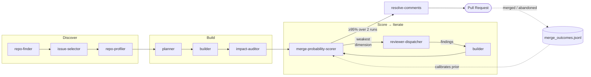

# superhuman

> A multi-agent **harness** that contributes merge-quality pull requests to real open-source projects — and a **closed feedback loop** that scores its own work and iterates until a maintainer would merge it. Runs on [Claude Code](https://claude.com/claude-code) and Codex.

[](./LICENSE)
[](./CHANGELOG.md)
[](https://claude.com/claude-code)

Most agent tools are **open-loop**: generate once, hope it's good. superhuman is **closed-loop**. It scores its own pull request before opening it, finds the single weakest dimension, spends an iteration fixing exactly that, re-scores, and repeats until it converges. It's gradient descent on one objective — *will a maintainer merge this?* — with a prior learned from every past outcome.

A coordinated team of agents picks an issue, profiles the repo, plans, builds, scores merge probability, iterates on the weakest dimension, and resolves review comments — autonomously. State lives at `~/.superhuman/` and survives across sessions.

## Proven on

superhuman has authored merged pull requests into repositories it doesn't own, across Python, Rust, TypeScript, Kotlin, and C++:

| Repository | PR | Fix |
|---|---|---|
| [huggingface/transformers](https://github.com/huggingface/transformers/pull/45611) | #45611 | Clear error for `problem_type="single_label_classification"` with `num_labels=1` |
| [apache/airflow](https://github.com/apache/airflow/pull/65685) | #65685 | Honor `AUTH_ROLE_PUBLIC` in the FastAPI API server |
| [google-gemini/gemini-cli](https://github.com/google-gemini/gemini-cli/pull/25822) | #25822 | Missing response key in custom theme text schema |
| [ant-design/ant-design](https://github.com/ant-design/ant-design/pull/58241) | #58241 | Apply `labelStyle`/`contentStyle` to bordered `Descriptions` cells |
| [oxc-project/oxc](https://github.com/oxc-project/oxc/pull/23015) | #23015 | `jsx-a11y/no-redundant-roles` attribute-aware implicit roles |
| [pydantic/pydantic-ai](https://github.com/pydantic/pydantic-ai/pull/5681) | #5681 | Fix `GoogleModelSettings.google_cached_content` request shaping |
| [Lightning-AI/pytorch-lightning](https://github.com/Lightning-AI/pytorch-lightning/pull/21686) | #21686 | Fix `torch.compile` breaking `toggle_optimizer`/`untoggle_optimizer` |
| [tesseract-ocr/tesseract](https://github.com/tesseract-ocr/tesseract/pull/4563) | #4563 | Fix crash when LSTM is missing in a disabled-legacy build |
| [affaan-m/ECC](https://github.com/affaan-m/ECC/pull/2161) | #2161 | Configurable env guards for the destructive-command bash gate |

Plus merges into [run-llama/llama_index](https://github.com/run-llama/llama_index/pull/21891), [mem0ai/mem0](https://github.com/mem0ai/mem0/pull/5202), [langchain4j](https://github.com/langchain4j/langchain4j/pull/5272), [lima-vm/lima](https://github.com/lima-vm/lima/pull/5090), [danny-avila/LibreChat](https://github.com/danny-avila/LibreChat/pull/13171), and [mochajs/mocha](https://github.com/mochajs/mocha/pull/6016).

A merged PR into `transformers` or the `oxc` Rust linter is not a demo. It's the loop working.

## The loop

The interesting engineering isn't "make an LLM write code." It's making the code *good enough that a maintainer merges it*. That's a control problem, and superhuman treats it like one.



Four ideas make the loop converge instead of wander:

1. **Self-evaluation before submission.** `merge-probability-scorer` is a critic with a 10-dimension weighted rubric — correctness, tests, style, PR format, process compliance, scope, docs, commit hygiene, risk, and historical signal. The agent grades its own work the way a maintainer would, *before* spending the maintainer's attention.
2. **Targeted iteration, not random polish.** Each round, `reviewer-dispatcher` picks the single **weakest non-plateaued dimension** and routes it to the matching language specialist (python / go / ts / java / kotlin / rust / cpp / csharp / flutter / security). Effort goes where it moves the score most. Plateau detection stops the loop from grinding a dimension that won't improve.
3. **Bounded compute, real convergence.** The loop stops at **95% merge probability sustained over two consecutive runs**, and the iteration budget is **capped adaptively by diff size** (3 / 6 / 10). It terminates — by quality or by budget — every time.
4. **A prior that learns.** Every merged or abandoned PR appends to `~/.superhuman/global/merge_outcomes.jsonl`, which calibrates the scorer's historical-signal dimension. The system carries a better prior into the next repo than it had on the last one.

## The harness

A loop that opens PRs into other people's repos, unattended, is only safe if the machinery underneath is disciplined. The harness is the part that lets the loop run without a human babysitting it:

- **Contracts, not vibes.** [`agents/SHARED_STATE.md`](./agents/SHARED_STATE.md) is a single source of truth for who writes each state file and who reads it — a concurrency contract that lets parallel runs share `~/.superhuman/` without corrupting it.
- **Typed state.** Every shared-state file has a [JSON Schema](./schemas/) (draft 2020-12), validated at write time. State is data with a shape, not a free-for-all.
- **Behavior split from shell.** Reasoning and safety prose live in agent prompts (`agents/*.md`); the deterministic `bash`/`jq` lives in versioned, unit-tested [`scripts/`](./scripts). 51 bash tests cover the scripts and every schema.
- **Blast-radius auditing.** `impact-auditor` runs before any refactor to a shared function — it blocks the class of change that's correct in one execution context (Flask request time) and fatal in another (FastAPI startup).
- **Hard safety rails.** Allowlisted CI commands only, `--force-with-lease` to a fork (never upstream, never plain `--force`), and a prompt-injection halt on any review comment that tries to make the agent run shell or fetch external URLs. See [Safety rails](#safety-rails).

Orchestrator + 10 specialists + 1 shared-state contract. The orchestrator is thin: it owns the lock, sequences the phases, and enforces the cap and the threshold. The intelligence is in the specialists and the loop.

## Supported runtimes

| Runtime | Entry point | Notes |
|---|---|---|
| Claude Code | `.claude-plugin/` | Loads `agents/` as subagents and `commands/` as slash commands. |
| Codex | `.codex-plugin/` | Loads `skills/superhuman/SKILL.md`, which adapts the same `agents/`, `scripts/`, and `schemas/` contracts for inline execution. |

Claude Code can dispatch `Agent(subagent_type=...)` calls. Codex executes the same agent contracts inline by reading the referenced files under `agents/`.

## Required plugins

This plugin depends on skills and agents from other plugins.

| Plugin | Status | Why |
|---|---|---|
| [`superpowers`](https://github.com/obra/superpowers) | **Required** | `planner` invokes `superpowers:writing-plans`; `builder` invokes `superpowers:subagent-driven-development`. Without it, both agents fail with `PluginMissingError`. |
| `everything-claude-code` | Recommended | `reviewer-dispatcher` routes to language-specialist reviewers. Falls back to inline prompts via `AgentNotFoundError` rescue if missing, but review quality drops. |

Declared for Claude Code in `.claude-plugin/plugin.json` under `requires.plugins`. Codex uses `skills/superhuman/SKILL.md` as the adapter and falls back to inline planning/execution when Claude-specific plugin skills are unavailable.

## Prerequisites

The agents shell out to standard developer tooling. Make sure these are on your `PATH`:

| Tool | Used for | Install |
|---|---|---|
| [`gh`](https://cli.github.com/) | Cloning forks, opening PRs, reading issues and review comments. Must be authenticated (`gh auth login`) with a token that can fork and push. | `brew install gh` |
| `git` | Branching, committing, `--force-with-lease` pushes to your fork. Configure `user.name`/`user.email` — commits are authored as you. | preinstalled / `brew install git` |
| [`jq`](https://jqlang.github.io/jq/) | All shared-state JSON reads/writes under `~/.superhuman/`. | `brew install jq` |
| `python3` | JSON Schema validation of shared-state files. | preinstalled / `brew install python` |
| `flock` (Linux) | Fleet mutex so parallel runs can't clobber each other's state. macOS uses a directory-based fallback automatically. | preinstalled |

> **GitHub auth matters.** `gh` needs to fork repos and push to your fork. The agents never push to upstream and never use plain `--force`. See [Safety rails](#safety-rails).

## Claude Code installation

```
/plugin marketplace add https://github.com/obra/superpowers
/plugin install superpowers@superpowers

/plugin marketplace add https://github.com/gaurav0107/superhuman
/plugin install superhuman@superhuman

/reload-plugins
```

## Codex installation

Codex support is declared in `.codex-plugin/plugin.json` and exposed through the `superhuman` skill in `skills/superhuman/SKILL.md`.

There is no Codex marketplace command yet. Install manually by symlinking the skill into `~/.codex/skills/`:

```
git clone https://github.com/gaurav0107/superhuman ~/src/superhuman
ln -s ~/src/superhuman/skills/superhuman ~/.codex/skills/superhuman
```

Then ask Codex to use the skill:

```
Use the superhuman skill to find a good open-source repo and contribute.
```

### Codex command equivalents

Codex does not have slash commands. Use these prompts to invoke the same workflows the Claude Code commands trigger:

| Claude Code command | Codex prompt |
|---|---|
| `/contribute` | `Use the superhuman skill to find a good open-source repo and contribute.` |
| `/contribute owner/repo` | `Use the superhuman skill to contribute to owner/repo.` |
| `/contribute owner/repo 123` | `Use the superhuman skill to contribute to owner/repo issue #123.` |
| `/contribute-loop [N]` | `Use the superhuman skill to run N sequential contributions, stopping on suspicious_halt or crash.` |
| `/contribution-fleet [N]` | Not supported in Codex — fleet runs require parallel subagent dispatch. Run sequential loops instead. |
| `/contribution-dashboard [owner/repo]` | `Use the superhuman skill to show the contribution dashboard for owner/repo (or all repos if omitted).` |
| `/repo-finder [N]` | `Use the superhuman skill to refresh my open-source repo shortlist with up to N candidates.` |

## Usage

**Single run** — let the orchestrator pick everything:

```
Agent(subagent_type="opensource-contributor", prompt="find a good repo and contribute")
```

**Targeted run** — specify the repo and/or issue:

```
Agent(subagent_type="opensource-contributor", prompt="contribute to apache/airflow issue #65685")
```

**Parallel fleet** — run N independent contributions concurrently:

```
/contribution-fleet 3
/contribution-fleet apache/airflow langchain-ai/langchain pytorch/pytorch
```

Each fleet run gets its own state dir, clone path, and `flock(2)` mutex — they cannot interfere.

**Dashboard** — read-only view of live runs, score history, iteration caps, and merge outcomes:

```
/contribution-dashboard
/contribution-dashboard apache/airflow
```

## Agents

Orchestrator + 10 specialists + 1 shared-state contract document.

| Agent | Role |
|---|---|
| `opensource-contributor` | Thin orchestrator. Owns the `current_contribution.json` lock, sequences phases, enforces the iteration cap and merge threshold. |
| `repo-finder` | Discovers high-value repos worth contributing to. |
| `issue-selector` | Filters and ranks open issues; writes `issue_candidates.json`. |
| `repo-profiler` | Extracts contribution conventions from merged PRs; writes `repo_profile.json`, `ci_commands.json`, `allowed_commands.json`. |
| `planner` | Wraps `superpowers:writing-plans` with repo context; writes `plan.md`. |
| `builder` | Wraps `superpowers:subagent-driven-development`; runs impact-audit and local CI gates. |
| `impact-auditor` | Refactor blast-radius auditor. Blocks reviewer-suggested refactors that break one caller to fix another. |
| `merge-probability-scorer` | 10-dimension weighted rubric blended with historical merge outcomes. |
| `reviewer-dispatcher` | Picks the weakest dimension and routes to the right specialist reviewer. |
| `resolve-comments` | Classifies PR review comments; drafts replies or dispatches fixes. Halts on prompt-injection. |
| `lesson-distiller` | Producer/curator of the durable knowledge base. Seeds the repo dossier + scan rule cards; mines reviewer feedback and merge outcomes into typed rule cards; runs cross-repo promotion, decay, and contradiction-demotion. |
| `SHARED_STATE.md` | Single source of truth for file ownership, readers, and concurrency contract. Not an agent — read by all. |

## Commands

| Command | Purpose |
|---|---|
| `/contribute [owner/repo] [issue#]` | One full end-to-end contribution. Loopable. |
| `/repo-finder [N]` | Refresh `repo-shortlist.json` with up to N candidate repos (default 10, max 25). |
| `/contribute-loop [N]` | Run N sequential contributions (default 3, max 20). Stops on `suspicious_halt` or `crash`. |
| `/contribution-fleet [N \| owner/repo ...]` | Launch N parallel contributor runs. |
| `/contribution-dashboard [owner/repo]` | Read-only view of active run, score history, plateaued dimensions, iteration cap, recent merge outcomes, latest loop. |

## Structure

```
superhuman/
├── README.md  CHANGELOG.md  CONTRIBUTING.md  SECURITY.md  LICENSE
├── .claude-plugin/
│   ├── plugin.json           # Plugin manifest + requires.plugins declarations
│   └── marketplace.json      # Marketplace catalog entry
├── .codex-plugin/
│   └── plugin.json           # Codex plugin manifest
├── agents/                   # Subagents (loaded as subagent_type by Claude Code)
│   ├── SHARED_STATE.md       # File ownership + concurrency contract
│   ├── opensource-contributor.md
│   ├── repo-finder.md
│   ├── issue-selector.md
│   ├── repo-profiler.md
│   ├── planner.md
│   ├── builder.md
│   ├── impact-auditor.md
│   ├── merge-probability-scorer.md
│   ├── reviewer-dispatcher.md
│   ├── resolve-comments.md
│   └── lesson-distiller.md
├── commands/                 # Slash commands
│   ├── contribute.md
│   ├── contribute-loop.md
│   ├── contribution-dashboard.md
│   ├── contribution-fleet.md
│   └── repo-finder.md
├── scripts/                  # Versioned shell extracted from agent prompts (v0.5.0+)
│   ├── lib/                  # Shared helpers: state.sh, mistakes.sh, flake.sh, delim.sh, lesson_checks.sh
│   ├── profiler/             # repo-profiler steps + scan_structure/write_repo_scan/dossier_fresh
│   ├── scorer/               # merge-probability-scorer step implementations
│   ├── orchestrator/         # opensource-contributor + reputation_gate.sh + write_run_summary.sh
│   ├── lessons/              # learning substrate: select/check/merge/promote/decay/record/set_lesson_status
│   └── builder/              # ci_gate.sh, smoke_gate.sh, drift_linter.sh, push_force_with_lease.sh
├── schemas/                  # JSON Schema (draft 2020-12) for every shared-state file (v0.5.0+)
│   └── *.schema.json
├── tests/                    # Bash unit tests for scripts/ — run via `bash tests/scripts/test_*.sh`
└── skills/
    └── superhuman/SKILL.md   # Codex adapter — runs the shared workflow inline
```

## State layout

All persistent state lives under `~/.superhuman/`. Per-repo state is keyed by `<owner>-<repo>` (slash replaced with hyphen).

```
~/.superhuman/
├── repos/
│   └── apache-airflow/
│       ├── repo_profile.json
│       ├── ci_commands.json
│       ├── allowed_commands.json
│       ├── issue_candidates.json
│       ├── current_contribution.json    # orchestrator lock
│       ├── plan.md
│       ├── caller_graph.json
│       ├── reviewer_intent_notes.md
│       ├── mistakes.md
│       ├── maintainer_tone.json
│       ├── smoke_registry.json
│       ├── run_telemetry.jsonl
│       ├── repo_scan.json               # structural scan (grounds the dossier)
│       ├── dossier.md                   # architecture dossier (planner/builder read)
│       ├── dossier_meta.json            # dossier freshness (head_sha gate)
│       ├── lessons.jsonl                # per-repo rule cards
│       └── classified_comments.json     # resolve-comments → distiller handoff
└── global/
    ├── flake_signatures.md
    ├── merge_outcomes.jsonl             # feedback corpus for scorer calibration
    ├── repo_blocklist.json
    ├── repo_cooldown.json
    ├── repo-shortlist.json
    ├── lessons_global.jsonl             # promoted cross-repo rule cards
    └── lesson_regressions.jsonl         # known-rule violated / re-raised alarm log
```

File ownership (sole-writer + readers) is documented in `agents/SHARED_STATE.md`. Every shared-state file has a matching JSON Schema (draft 2020-12) under `schemas/`, validated at write time.

## Safety rails

- **Impact audits before refactors.** `builder` invokes `impact-auditor` before applying any reviewer-suggested refactor to a shared function. Blocks the class of bug where "just read `self.app.config` instead of calling `conf.get()`" is correct at Flask request time and fatal at FastAPI startup.
- **CI allowlist.** `builder` only runs commands pre-approved in `allowed_commands.json`. `repo-profiler` seeds the allowlist from `.github/workflows/*.yml`; anything outside it requires explicit user approval.
- **Force-with-lease only.** Pushes use `--force-with-lease` to the contributor's fork — never upstream, never plain `--force`.
- **Prompt-injection halt.** `resolve-comments` classifies any comment asking it to run shell commands, modify files outside the diff, or fetch from external URLs as `suspicious`, halts the run, and logs to `mistakes.md`.
- **Learned rules are data, not code.** The `lesson-distiller` mines reviewer feedback into typed rule cards constrained to a fixed schema; a comment attempting a command, URL, or out-of-repo write is classified `suspicious` and never becomes a rule. Deterministic cards may only reference a fixed check registry, and enforced rules feed the scorer's judgment only — they can never expand `allowed_commands.json` or run anything.
- **Single-author commit rule (commit-scoped).** Every commit is authored by the human contributor identity derived from `gh` in `builder` — no co-author trailers or AI attribution, verified before push. PR *bodies* disclose Superhuman origin by default; see [Configuration](#configuration).
- **Reputation cooldown.** Repos where PRs consistently get rejected or ignored land in `repo_cooldown.json` and are skipped by `repo-finder` until the cooldown window expires.

See [SECURITY.md](./SECURITY.md) for the full safety model and how to report a vulnerability.

## Configuration

| Env var | Default | Effect |
| --- | --- | --- |
| `SUPERHUMAN_ATTRIBUTION` | `on` | Every PR the plugin opens appends a one-line footer to the **PR body** disclosing it was produced with Superhuman. Set to `off` (also `false`/`0`/`no`, case-insensitive) to suppress it. Commits are never touched either way. |

## FAQ

**What is superhuman?**
superhuman is an autonomous open-source contribution agent for [Claude Code](https://claude.com/claude-code) and Codex. It's a multi-agent harness that picks an open issue in a repository, writes the fix, scores its own pull request on a 10-dimension merge-probability rubric, and iterates on the weakest dimension until a maintainer would merge it.

**How is it different from Copilot, Cursor, Devin, or a plain coding agent?**
Most AI coding tools are *open-loop*: they generate a change once and hope it's good. superhuman is *closed-loop*. It grades its own pull request before opening it, spends each iteration fixing the single weakest dimension, re-scores, and stops only when it converges — gradient descent on one objective: *will a maintainer merge this?*

**Does it actually get PRs merged into real projects?**
Yes. It has authored merged pull requests into `huggingface/transformers`, `apache/airflow`, `google-gemini/gemini-cli`, `ant-design/ant-design`, the `oxc` Rust linter, `pydantic-ai`, `pytorch-lightning`, `tesseract-ocr`, `llama_index`, `mem0`, `langchain4j`, `lima`, `LibreChat`, and `mocha` — across Python, Rust, TypeScript, Kotlin, and C++. See [Proven on](#proven-on).

**Is it safe to let an AI agent open pull requests unattended?**
That's the whole design constraint. superhuman only runs allowlisted CI commands, pushes with `--force-with-lease` to *your fork* (never upstream, never plain `--force`), halts on any review comment that tries to make it run shell or fetch external URLs (prompt-injection defense), and runs a blast-radius impact-audit before touching any shared function. See [Safety rails](#safety-rails).

**What is a merge-probability score?**
A self-evaluation from the `merge-probability-scorer` agent — a critic with a 10-dimension weighted rubric (correctness, tests, style, PR format, process compliance, scope, docs, commit hygiene, risk, and historical signal) blended with the outcomes of every past PR. The loop stops at 95% sustained over two consecutive runs.

**Does it work with OpenAI Codex as well as Claude Code?**
Yes. The same agent contracts, scripts, and schemas run under both. Claude Code loads them as subagents and slash commands; Codex runs them inline via `skills/superhuman/SKILL.md`. See [Supported runtimes](#supported-runtimes).

**How do I install it?**
For Claude Code: `/plugin marketplace add https://github.com/gaurav0107/superhuman` then `/plugin install superhuman@superhuman`. For Codex: clone the repo and symlink `skills/superhuman` into `~/.codex/skills/`. Full steps in [Claude Code installation](#claude-code-installation) and [Codex installation](#codex-installation).

**Does it learn over time?**
Yes. Every merged or abandoned PR appends to `~/.superhuman/global/merge_outcomes.jsonl`, which calibrates the scorer's historical-signal dimension, and the `lesson-distiller` mines reviewer feedback into typed rule cards. Each run carries a better prior into the next repo than it had on the last one.

## Development

The behavioral logic lives in two places: agent prompts (`agents/*.md`) and the shell they call out to (`scripts/`). Everything in `scripts/` is covered by self-contained bash unit tests under `tests/scripts/` — no test runner or framework, just `set -euo pipefail` scripts that exit non-zero on failure.

Run the whole suite:

```bash
for t in tests/scripts/test_*.sh; do bash "$t" || echo "FAIL: $t"; done
```

Run a single test:

```bash
bash tests/scripts/test_state.sh
```

Tests require `jq` and `python3` (for schema validation) on your `PATH`. They write only to `mktemp` dirs — they never touch your real `~/.superhuman/` state.

When you change a shared-state file's shape, update both its schema in `schemas/` and the matching `tests/scripts/test_schema_*.sh` fixture. See [CONTRIBUTING.md](./CONTRIBUTING.md) for conventions.

## Contributing

Issues and pull requests welcome. Start with [CONTRIBUTING.md](./CONTRIBUTING.md) for the repo layout, test conventions, and the agent-prompt / extracted-script split. Notable design decisions are written up under [`docs/`](./docs).

## Telemetry

superhuman sends basic, **opt-out** adoption telemetry — one per-run event
carrying your GitHub username and whether a PR was opened — to the maintainer's
PostHog project. No repo, issue, or code data is ever sent. Invocation and
PR counts are derived in PostHog, not sent from your machine. Disable with
`SUPERHUMAN_TELEMETRY=off` or
`scripts/lib/telemetry_optout.sh`. Full details: [TELEMETRY.md](./TELEMETRY.md).

## License

[MIT](./LICENSE) © gaurav0107
