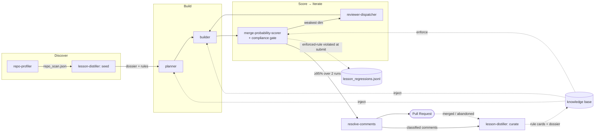

# Design — A learning substrate for cross-run, cross-repo knowledge

**Date:** 2026-07-03
**Repo:** superhuman (autonomous OSS contribution plugin for Claude Code + Codex)
**Author:** gaurav0107
**Status:** Draft, pending user review

## Goal

Make superhuman *learn* — so it stops earning the same reviewer comments PR after
PR, and lands more first-drafts in the right place. The user's words: "make its
learning better" and "understands the repo requirement well so we end up with
more commits."

Two outcomes, one root cause:

1. **Stop recurring reviewer comments.** The user keeps seeing the *same class*
   of feedback across merged PRs. That is a learning failure: feedback is
   observed but never converted into a durable, enforced constraint that
   prevents the same comment next time.
2. **Understand the repo well enough to be right the first time.** Fewer
   "wrong layer / you reinvented `parse_jwt` / rename this / put the test in
   the right dir" round-trips means faster convergence and more merges.

Both bottleneck on the same missing primitive: **durable, retrievable, and
*enforced* knowledge** — reviewer-taught conventions *and* repo architecture —
that persists across runs and generalizes across repos. This spec designs that
primitive: the **learning substrate**.

## Why this is worth doing

superhuman is closed-loop *within* a single PR run (comment → fix → re-score →
next iteration) but **open-loop across runs and across repos.** An audit of the
current learning paths found the loop is written but never read back:

| Signal | Written by | Read back as a future-run input? | Evidence |
|---|---|---|---|
| Reviewer comment *content* | `resolve-comments` | **No** — text is classified, used for the current PR, then discarded | `resolve-comments.md` findings schema carries paraphrase only; comment text never persisted |
| `merge_outcomes.jsonl` | scorer, on terminal state | Only as a coarse per-repo merge ratio | `scripts/scorer/record_outcome.sh:26-30` (fields: `pr_url, repo, outcome, final_scores, iterations, closed_at` — no *why*) |
| Historical signal | scorer | Laplace-smoothed merge/abandon ratio, per-repo only; can't say "PRs *like this*" | `scripts/scorer/historical_blend.sh:28-45`, weight `0.3` |
| `reviewer_intent_notes.md` | `resolve-comments` | Passed to planner as **"untrusted, apply judgment"** — advisory, unenforced | `planner.md:52,102-105` |
| `mistakes.md` | builder, resolve-comments | Planner reads it; **builder claims to read it but has no actual read path** | `builder.md:39-40,193` (listed, never loaded) |
| `maintainer_tone.json` | `resolve-comments` | Only styles *replies* — never influences code | `resolve-comments.md:104-111,397-399` |
| `run_telemetry.jsonl` | orchestrator | **No** — dashboard-only, write-only | read only by `/contribution-dashboard` |
| `repo_profile.json` | `repo-profiler` | Process conventions only; **no architecture**, and **never refreshed** | schema fields at `repo_profile.schema.json:9-24`; profiled once (`SHARED_STATE.md:271`), `generated_at` for audit only |

Two structural facts fall out of the table:

- **Reviewer comment text is never durably learned.** It is treated as
  transient, per-run, per-repo, and advisory. Nothing turns "vincbeck asked for
  a newsfragment" into a rule that *blocks* the next airflow PR that forgets one.
  This is precisely the recurring-comment pain.
- **Repo understanding is *process*, not *architecture*.** The profiler extracts
  commit format, PR template, test runner, and lint commands. It has **zero
  model** of module boundaries, naming conventions, where things live, or which
  utilities already exist. File discovery is keyword-grep → top-10, no
  disambiguation (`planner.md:78-83`). This directly produces the "wrong place /
  reinvented / renamed" class of comments.

The scorer — the critic that runs *before* submission — never sees comment
content, so its prior can't sharpen on the dimensions reviewers actually flag
(`merge-probability-scorer.md:90` reads only `repo_profile.json`,
`ci_commands.json`, `current_contribution.json`, `merge_outcomes.jsonl`).

## Constraints (non-negotiable)

1. **Honor the architecture ethos.** Flat typed JSON + `jq` + JSON Schema
   (draft 2020-12) + bash-testable, no database, no embeddings, human-inspectable.
   The learning substrate is more of the same, not a new subsystem paradigm.
2. **Reasoning in prompts, mechanism in scripts.** The distiller's *judgment*
   (mine a rule from a comment, author a dossier, resolve a contradiction) lives
   in an agent prompt. The deterministic *mechanism* (retrieval, dedupe,
   promotion arithmetic, decay, named checks) lives in versioned, unit-tested
   `scripts/` with `set -euo pipefail`.
3. **Graceful degradation.** An empty or absent knowledge base MUST make the
   system behave exactly as it does today. Retrieval returns nothing; the
   compliance gate passes; no phase hard-fails because a lesson file is missing.
4. **Safety is not weakened by a new durable injection surface.** Mining rules
   *from untrusted reviewer comments* is a durable prompt-injection vector. A
   mined "rule" can never execute a command, fetch a URL, touch a path outside
   the repo, or expand `allowed_commands.json`. See Safety below. Existing
   `resolve-comments` `suspicious`-halt posture is inherited unchanged.
5. **Single-writer discipline.** The `lesson-distiller` is the **sole writer**
   of every knowledge-base file. Producers hand it raw inputs; it authors the
   store. This preserves the `SHARED_STATE.md` ownership contract and keeps
   parallel fleet runs safe.
6. **No new dependencies.** Bash 3.2 (macOS default), `jq`, `gh`, `git`,
   `python3`. Same as today.
7. **Bounded, not just captured.** Every durable store has a cap, a decay
   policy, and a retire path. The substrate must not grow without bound or
   contradict itself silently.

## Premises (all hold)

- **P1: The failure is *enforcement*, not *capture*.** The system already
  captures reviewer intent (`reviewer_intent_notes.md`) — it just passes it as
  advisory "apply judgment" and the builder never reads it. A better store that
  stays advisory would repeat the failure. Therefore the substrate must *prevent
  early and enforce late*, not merely inject richer context.
- **P2: Conventions split cleanly into deterministic and semantic.** "A
  newsfragment file exists," "the test lives under `tests/**`," "the commit
  matches the convention" are *checkable by script*. "Prefer private fields,"
  "reuse the existing util," "this belongs in the services layer" need an LLM
  judgment. The substrate models both kinds and routes each to the right gate.
- **P3: Architectural narrative resists flattening to rules.** "Services owns
  business logic; models are ORM-only" is guidance, not a pass/fail check. So
  the substrate needs a freeform companion (the dossier) alongside typed rules.
- **P4: Grounding beats exploring.** An LLM that summarizes a real directory/
  symbol scan hallucinates far less than one exploring a repo blind, and costs
  less. The dossier is authored *from* a deterministic scan artifact.
- **P5: Generalization must be earned.** A convention seen on one repo is a
  hypothesis, not a law. Enforcing it elsewhere on one data point risks causing
  *wrong* comments in other repos. Cross-repo promotion must be graduated —
  mirroring the existing "95% sustained over two runs" convergence philosophy.

## Design decisions (the forks, resolved)

Six coupled decisions define the substrate. Each was explored as A/B/C during
brainstorming; the chosen option and the rejected alternatives are recorded here
so the plan and future readers can see the reasoning, not just the result.

### D1 — Scope: one coordinated substrate ✅

Both goals (stop recurring comments; understand the repo) are the same missing
primitive. **Design the shared substrate once**; let comment-learning and
repo-understanding both consume it. *Rejected:* two parallel mechanisms (bolted-on
comment memory + a separate repo map) — duplicative, and neither would generalize.

### D2 — Atomic unit: hybrid rule cards + dossier ✅

- **Typed rule cards** (JSON, schema-validated) for *enforceable conventions* —
  retrievable, dedupable, cross-repo-generalizable.
- **A freeform repo dossier** (`dossier.md`) for *architectural narrative* that
  doesn't reduce to a pass/fail rule.

*Rejected:* **freeform-only** layered prose (today's `mistakes.md` at scale — no
deterministic retrieval, can't dedupe, can't enforce, unbounded growth);
**typed-only** (loses the architectural narrative that genuinely helps land the
first draft).

### D3 — Enforcement: prevent early *and* enforce late, split by kind ✅

- **Prevent:** retrieved cards + dossier are injected into planner and builder as
  **mandatory** context (not "apply judgment"). Fixes the builder's missing read
  path.
- **Enforce:** the scorer runs a **convention-compliance gate**. Deterministic
  rules → a scripted check (certain, bash-tested). Semantic rules → an LLM check.
  A violated **enforced** rule **hard-caps** the score below the 95% threshold
  (idiomatic with the scorer's existing cap rules); **candidates advise only.**
- The late gate doubles as the **"did we regress on a known lesson?" detector.**

*Rejected:* **soft injection only** (what exists today, in weak form — it fails);
**hard gate only** (wastes iterations re-fixing what injection could have made
right on the first draft).

### D4 — Cross-repo: graduated promotion ✅

`repo` → `global-candidate` (recurrence across ≥2 distinct repos proposes it;
lands as **advisory**, injected but not enforced) → `global` (enforced only after
an *independent* confirmation on a second repo). Every global rule still fires
only where its `match` allows (`lang`/`dimensions`/`paths` gate it), so a Java
encapsulation rule never triggers on a Python diff.

*Rejected:* **explicit-only** (no transfer learning — the siloed status quo);
**immediate auto-promotion** (one repo's quirk hard-blocks PRs elsewhere).

### D5 — Producer/curator: a dedicated `lesson-distiller` agent ✅

One new specialist is the **sole owner** of the knowledge base. It mines rule-card
candidates from comments/outcomes/scan, merges/dedupes, runs promotion
clustering, applies decay, resolves contradictions, and authors the dossier.
Everything about the knowledge base lives in one auditable, testable place.

*Rejected:* **distributed** (mining logic scattered across three agents; no single
place to cluster for promotion or resolve contradictions); **hybrid capture/curate
staging layer** (a real optimization, but YAGNI for this round — split later if
the distiller phase gets expensive).

### D6 — Dossier depth: layered, scan-grounded ✅

The profiler emits a deterministic **scan artifact** (`repo_scan.json`:
directory/module layout, test-location convention, naming patterns, top exported
symbols). The distiller's LLM pass authors the dossier **grounded in that scan**,
and emits deterministic scan-rules (test location, naming). A freshness check
re-scans when the profile goes stale or HEAD moved — fixing the "cached forever"
gap.

*Rejected:* **shallow structural** (catches wrong-dir/naming but no architectural
model); **deep architectural exploring blind** (more tokens, more hallucination).

## Architecture

Three new capabilities, one new agent, one new script package, four new schemas.
The existing loop is unchanged in shape; the substrate hangs off it.



### State layout

Per-repo (`~/.superhuman/repos/<slug>/`):

```
repo_scan.json          # NEW — profiler-owned. Raw structural facts (dirs, tests, naming, symbols) + head_sha at scan time.
dossier.md              # NEW — distiller-owned. Architectural narrative, scan-grounded.
dossier_meta.json       # NEW — distiller-owned. Freshness: {head_sha (copied from repo_scan.json), scanned_at, authored_at, scan_digest}.
lessons.jsonl           # NEW — distiller-owned. repo-scoped rule cards (one per line).
```

Global (`~/.superhuman/global/`):

```
lessons_global.jsonl    # NEW — distiller-owned. `global` + `global-candidate` cards.
lesson_regressions.jsonl# NEW — distiller-owned. "known rule violated / re-raised" events.
```

`merge_outcomes.jsonl` stays exactly as-is (lean — outcome only). Lessons live in
their own files so the outcome corpus and the knowledge base evolve independently.

### New schemas (draft 2020-12, under `schemas/`)

- `rule_card.schema.json` — one object per line in `lessons.jsonl` /
  `lessons_global.jsonl`.
- `repo_scan.schema.json` — the profiler's structural artifact.
- `dossier_meta.schema.json` — dossier freshness metadata.
- `lesson_regression.schema.json` — regression-event log line.

`dossier.md` is freeform prose — no schema (like `mistakes.md`,
`reviewer_intent_notes.md`).

### Rule card — final shape

```json
{
  "id": "apache-airflow-newsfragment",
  "scope": "repo",
  "match": {
    "repo": "apache/airflow",
    "lang": "python",
    "paths": ["airflow-core/**"],
    "dimensions": ["process"]
  },
  "kind": "deterministic",
  "rule": "Add a newsfragment under newsfragments/ for any user-facing change.",
  "check": { "id": "file_present", "args": { "glob": "newsfragments/*" } },
  "source": "comment",
  "evidence": ["PR#65685 review by vincbeck 2026-04-23"],
  "confidence": 0.8,
  "hits": 3,
  "repos_seen": ["apache/airflow"],
  "status": "active",
  "created": "2026-04-23T…",
  "last_confirmed": "2026-06-30T…"
}
```

Field contract:

- `scope` ∈ `repo | global-candidate | global`.
- `match` gates *where a card applies* (`repo` present only for `repo` scope;
  global cards match by `lang`/`paths`/`dimensions`).
- `kind` ∈ `deterministic | semantic`. `check` is **present iff**
  `kind == deterministic`, and `check.id` MUST be a member of the fixed check
  registry (below). A card whose `check.id` is unknown is forced to `semantic`
  at write time — it can never execute anything.
- `rule` is **descriptive prose only.** There is deliberately **no** command,
  URL, or path-outside-repo field anywhere in the schema (Safety §S1).
- `source` ∈ `comment | outcome | scan`.
- `confidence` ∈ [0,1]; `hits` = confirmations; `repos_seen` drives graduation.
- `status` ∈ `active | demoted | retired`.

**Enforced** ≡ `status == active` AND `confidence ≥ ENFORCE_MIN (0.75)` AND
(`scope == repo` OR `scope == global`). `global-candidate` cards are **advisory**
regardless of confidence — they inject but never cap.

### The fixed check registry (safety-critical)

Deterministic checks are a **closed set** of named functions defined in code
(`scripts/lib/lesson_checks.sh`), each with typed args and a bash test. Mined
rules may only *reference* a registry entry — they can never introduce a new one.
Initial registry:

| `check.id` | Args | Passes when |
|---|---|---|
| `file_present` | `glob` | a repo path matching `glob` exists after the diff |
| `file_in_dir` | `class`, `path_glob` | changed files of `class` (e.g. `test`) live under `path_glob` |
| `commit_matches` | `convention` | HEAD commit subject matches the repo commit convention |
| `identifier_case` | `style`, `scope` | new identifiers in the diff follow `style` (`snake`/`camel`/`pascal`) |
| `import_sorted` | `tool` | changed source files pass the repo's import-order tool |

New checks are added by developers (code + test), reviewed like any other script.
This keeps the *executable surface fixed* while the *rule set learns*.

## Data flow (lifecycle): Birth → Retrieve → Prevent → Enforce → Curate

**Birth.** The `lesson-distiller` mints candidate cards from three sources:
- *comment* — classified review comments from `resolve-comments` (nit / refactor /
  concern → a convention hypothesis).
- *outcome* — merge/abandon patterns from `merge_outcomes.jsonl` + the run's final
  scores.
- *scan* — the profiler's `repo_scan.json` (test location, naming) → deterministic
  scan-rules.

**Retrieve.** `scripts/lessons/select_lessons.sh` filters `lessons.jsonl` +
`lessons_global.jsonl` by `match` (repo / lang / path-glob / dimension), ranks by
`confidence`, and caps the injected set at `N (default 40)`. Deterministic and
enforced cards rank first; candidates last.

**Prevent.** Retrieved cards + the dossier are injected into `planner` and
`builder` as **mandatory** context (not "apply judgment"). Deterministic enforced
rules also run as a **builder pre-push gate** (`check_lessons.sh`) so a structural
violation never even reaches the scorer.

**Enforce.** The scorer's **convention-compliance gate**:
1. `check_lessons.sh` runs every retrieved deterministic card's `check` against
   the diff → list of deterministic violations (certain).
2. An LLM pass judges the diff against retrieved **semantic** enforced cards →
   list of semantic violations (high-confidence, clear-cut only).
3. If any **enforced** rule is violated → **Convention-compliance cap**: the final
   merge probability is capped below the 95% threshold and each offending rule is
   named in the blocking-dimension list. **Candidates** produce an advisory note,
   never a cap.
4. Emit a `convention_compliance` sub-signal for the dashboard.

**Curate** (distiller, at run-end and after each comment round):
- **Merge/dedupe** new candidates into existing cards (`merge_cards.sh`): same
  normalized rule → bump `hits`, raise `confidence`, refresh `last_confirmed`,
  append `evidence`.
- **Promote** (`promote_lessons.sh`): a repo card whose normalized rule recurs
  across ≥2 distinct repos becomes a `global-candidate` (advisory); a
  `global-candidate` independently confirmed on a second repo graduates to
  `global` (enforced).
- **Decay** (`decay_lessons.sh`): lower `confidence` with age; retire below
  `RETIRE_MAX (0.25)` or after 180 days without confirmation (same spirit as the
  existing `maintainer_tone` 180-day prune).
- **Resolve contradictions**: a new observation that contradicts an *enforced*
  rule (a maintainer says the opposite, or the repo's own merged PRs disprove it)
  → **demote to candidate + lower confidence + log**. Never silently flip an
  enforced rule.
- **Detect regressions** (`record_regression.sh`): an enforced rule violated at
  submission time, or a maintainer re-raising a rule already in the store → append
  to `lesson_regressions.jsonl` `{rule_id, repo, pr_url, kind, ts}`. This is the
  "same comment recurred = learning failed" alarm; it surfaces on the dashboard.

## Integration (minimal diffs to existing agents)

| Agent / file | Change |
|---|---|
| `repo-profiler.md` | + step: emit `repo_scan.json` (dir/module layout, test-location convention, naming-pattern samples, top exported symbols) and record `head_sha` for the freshness check. **Owns `repo_scan.json`.** No dossier/card writes (single-writer). |
| `lesson-distiller.md` (**NEW**) | Two modes. **Seed:** read `repo_scan.json` → author `dossier.md` + `dossier_meta.json` + deterministic scan-cards into `lessons.jsonl` (only when dossier is missing or stale). **Curate:** mine comments + outcome + diff → merge / promote / decay / contradiction / regression. **Sole writer** of all knowledge-base files. Calls `scripts/lessons/*` for mechanism; keeps judgment in prompt. |
| `planner.md` | Inject `select_lessons.sh` output + `dossier.md` as **mandatory** context. Replaces the "untrusted, apply judgment" framing for *enforced* rules (candidates stay advisory). |
| `builder.md` | Same injection — **fixes the missing read path** (`builder.md:39-40` lists the files but never loads them). Add deterministic enforced rules as a pre-push gate via `check_lessons.sh`. |
| `merge-probability-scorer.md` | + **Convention-compliance cap** (deterministic + semantic gate) alongside the existing Process / CI-health caps. Emit `convention_compliance` signal. Outcome recording unchanged. |
| `resolve-comments.md` | Hand classified comments to the distiller (curate mode). `reviewer_intent_notes.md` and `maintainer_tone.json` behavior unchanged — intent notes still drive replies; the distiller adds the durable-rule path. |
| `opensource-contributor.md` | Sequence the distiller: **seed** after profiling (Phase 2.5, freshness-gated), **curate** at run-end and after each comment round. Pass state paths. Non-fatal on distiller failure. |
| `agents/SHARED_STATE.md` | Register the 6 new files + ownership (distiller = sole writer of 5; profiler owns `repo_scan.json`). Add the new run-trace steps. Document the new schemas. |

### New script package

```
scripts/lessons/
├── select_lessons.sh     # retrieval: match → rank → cap N        (planner, builder, scorer)
├── check_lessons.sh      # deterministic gate: run named checks vs diff (builder pre-push, scorer)
├── merge_cards.sh        # dedupe/merge candidate → bump hits/confidence  (distiller)
├── promote_lessons.sh    # graduation clustering repo→candidate→global    (distiller)
├── decay_lessons.sh      # age/confidence decay + retire                  (distiller)
└── record_regression.sh  # append lesson_regressions.jsonl                (distiller, scorer)
scripts/lib/
└── lesson_checks.sh      # the fixed check registry (named check functions)
```

Every script follows the existing convention: `#!/usr/bin/env bash`,
`set -euo pipefail`, `: "${CLAUDE_PLUGIN_ROOT:?…}"`, sources `lib/state.sh`,
documents args + exit codes (0 ok / 1 recoverable / 2 abort) in a header comment.

### Dashboard

`/contribution-dashboard` gains a **Learning** panel: rule-card counts by
scope/status, most-confirmed rules per repo, pending `global-candidate`
promotions, and — most importantly — recent `lesson_regressions.jsonl` entries
(the recurring-comment alarm the user asked for made visible).

## Build order

1. **Schemas + check registry first.** Write `rule_card`, `repo_scan`,
   `dossier_meta`, `lesson_regression` schemas and `scripts/lib/lesson_checks.sh`
   (the fixed named checks). Bash tests: `test_schema_rule_card.sh`,
   `test_schema_repo_scan.sh`, `test_schema_dossier_meta.sh`,
   `test_schema_lesson_regression.sh`, `test_lesson_checks.sh` (per check, on a
   fixture diff).
2. **Retrieval + deterministic gate.** `select_lessons.sh` and
   `check_lessons.sh` against a synthetic `lessons.jsonl` fixture. Tests:
   `test_select_lessons.sh` (match/rank/cap), `test_check_lessons.sh`
   (satisfy/violate each check). These are pure functions of files on disk —
   easiest to verify, and they unblock both the builder gate and the scorer gate.
3. **Curation mechanics.** `merge_cards.sh`, `promote_lessons.sh`,
   `decay_lessons.sh`, `record_regression.sh`. Tests: `test_merge_cards.sh`
   (dedupe + confidence bump), `test_promote_lessons.sh` (repo→candidate→global
   graduation, incl. the "needs a *second distinct* repo" gate),
   `test_decay_lessons.sh` (age retire + confidence floor).
4. **Profiler scan artifact.** Add `repo_scan.json` emission to `repo-profiler`.
   Verify on one cached repo; diff the structural facts against a hand-checked
   baseline.
5. **`lesson-distiller` agent.** Author `agents/lesson-distiller.md` (seed +
   curate modes) wiring the scripts above. Seed mode grounded strictly in
   `repo_scan.json`. Register in `.claude-plugin/plugin.json` and the Codex
   `skills/superhuman/SKILL.md` adapter.
6. **Prevent-side injection.** Wire `select_lessons.sh` + dossier into `planner`
   and `builder` (mandatory context; builder read-path fix; builder pre-push
   gate).
7. **Enforce-side gate.** Add the Convention-compliance cap to
   `merge-probability-scorer` (deterministic + semantic), the `convention_compliance`
   signal, and the submission-time regression detection.
8. **Orchestration + docs.** Sequence the distiller phases in
   `opensource-contributor` (seed freshness-gated; curate at run-end + per comment
   round; non-fatal). Update `SHARED_STATE.md` (files, ownership, run trace,
   schemas), the dashboard Learning panel, `README.md`, and `CHANGELOG.md`. Bump
   `.claude-plugin/plugin.json` and `.codex-plugin/plugin.json` to **0.8.0**.

After each step: run the full bash suite
(`for t in tests/scripts/test_*.sh; do bash "$t"; done`) and confirm graceful
degradation (delete the fixture knowledge base; the phase must behave as today).

## Success criteria

- **Recurring comments become visible and preventable.** A rule mined from a
  reviewer comment on PR #1 to a repo is *enforced* on PR #2 to the same repo: a
  diff that violates it cannot reach the 95% threshold, and the offending rule is
  named. Verified end-to-end on a fixture repo with a `file_present`
  (newsfragment) rule.
- **The regression alarm fires.** Shipping a PR that violates an enforced rule,
  or a maintainer re-raising a stored rule, appends to `lesson_regressions.jsonl`
  and shows on the dashboard. Verified by injecting both cases.
- **Cross-repo transfer is graduated.** A rule confirmed on repo A becomes a
  `global-candidate` (advisory) and only enforces globally after an independent
  confirmation on repo B. Verified with a two-repo fixture: candidate does **not**
  cap on repo B before confirmation; enforces after.
- **Wrong-quirk containment.** A `global-candidate` never hard-blocks a PR; only
  `repo`/`global` enforced rules cap. Verified: a candidate violation yields an
  advisory note, not a cap.
- **Repo understanding is deeper.** The dossier names module boundaries, test
  location, and ≥1 reuse-catalog entry for a real repo, grounded in
  `repo_scan.json` (no hallucinated paths — every cited path exists).
- **Freshness works.** Re-running against a repo whose HEAD moved past the
  `dossier_meta` threshold triggers a re-scan; an unchanged HEAD reuses the cached
  dossier.
- **Graceful degradation.** With the knowledge base absent, a full run
  (issue-selector → profiler → planner → builder → scorer → reviewer-dispatcher →
  resolve-comments) completes with zero behavior delta vs. today.
- **Safety preserved.** No mined rule can execute a command, fetch a URL, touch a
  path outside the repo, or expand `allowed_commands.json`. A card with an unknown
  `check.id` is forced `semantic`. `resolve-comments` `suspicious`-halt still fires
  (unchanged). Verified by a hostile-comment fixture that *tries* to plant an
  executable rule and is rejected at distill time (logged to `mistakes.md`).
- **Bounded.** Decay retires stale/low-confidence cards; `merge_cards.sh` dedupes;
  injection is capped at N. The store does not grow without bound across a
  simulated 50-run history.
- **Tests + no new deps.** New bash tests pass in the existing suite. No change to
  `requires.plugins` or system requirements.

## Risks

- **False-positive semantic block.** A misjudged semantic rule could hard-cap a
  good PR indefinitely. *Mitigations:* only high-confidence *enforced* rules cap;
  candidates only advise; the gate names the offending rule so the loop can fix or
  a human can override; the contradiction path demotes rules the repo's own merged
  PRs disprove; the existing 3/6/10 iteration cap guarantees termination
  (`abandoned`) rather than an infinite loop.
- **Over-generalization.** A repo-specific quirk promoted too eagerly causes
  *wrong* comments elsewhere. *Mitigation:* graduated promotion (D4) — candidates
  never enforce; a second *distinct-repo* confirmation is required; `match.lang`/
  `dimensions` gate applicability.
- **Durable prompt injection (highest-severity).** A malicious comment tries to
  plant a rule that later drives behavior. *Mitigations, defense-in-depth:* the
  rule-card schema has no executable field; deterministic checks are a closed,
  code-defined registry (mined rules can only *reference*, never *define*);
  enforced rules feed only the scorer's judgment, never builder shell or the CI
  allowlist; unknown `check.id` degrades to advisory `semantic`; distill-time
  rejection of any candidate implying a command, logged to `mistakes.md`;
  `resolve-comments` `suspicious`-halt unchanged.
- **Distiller cost.** An extra agent per run + per comment round. *Mitigations:*
  seed mode is freshness-gated (skips when the dossier is fresh); mechanism is
  scripted `jq` (cheap); only the mine/author/contradiction judgment is LLM;
  non-fatal on failure. If it still proves heavy, the deferred capture/curate
  split (D5 option C) recovers most of the cost.
- **Semantic-rule verifier drift.** The LLM gate must judge violations
  consistently. *Mitigation:* the gate prompt is deterministic-input (fixed rule
  text + diff), high-confidence-only, and the deterministic checks carry the
  load-bearing conventions; semantic rules are the assistive layer, not the spine.
- **Schema strictness.** New draft-2020-12 schemas over evolving data.
  *Mitigation:* `additionalProperties: true`, required-list = minimal, JSONC
  intent transcribed into `description` fields (same posture as the existing
  schemas from the bash-extraction round).

## Open questions

- **Q1 — normalization for dedupe/promotion.** How is "the same rule" detected
  across cards for `merge_cards.sh` / `promote_lessons.sh`? *Default:* normalize
  on (`kind`, `check.id` + args) for deterministic cards; for semantic cards,
  cluster on a stemmed/lowercased `rule` bag-of-words with a similarity threshold,
  and let the distiller LLM confirm a merge before it happens. Revisit if
  clustering proves noisy.
- **Q2 — confidence constants.** `BIRTH=0.5`, `+0.15/confirmation`,
  `ENFORCE_MIN=0.75`, `RETIRE_MAX=0.25`, 180-day decay window. *Default:* ship
  these as named constants in one script header, tunable without touching logic;
  calibrate against real `merge_outcomes.jsonl` history in a follow-up.
- **Q3 — dossier freshness threshold.** Re-scan on any HEAD change, or only when
  the diff since `scanned_at` touches structural files (dir moves, new packages)?
  *Default:* re-scan when HEAD differs AND the changed-file set intersects
  structural globs (top-level dirs, build manifests), else reuse. Cheaper, avoids
  churn on doc-only upstream movement.
- **Q4 — should the issue-selector consume the substrate?** The dossier's reuse
  catalog + module map could improve fix-discoverability scoring. *Default:* out of
  scope this round (that was option D in brainstorming). The dossier is available
  for a later `issue-selector` upgrade.

## Next steps

1. User reviews this spec.
2. On approval, invoke `superpowers:writing-plans` to produce the implementation
   plan from this design.
3. Plan should sequence the build order above, one PR per step, each with tests
   and a graceful-degradation check.
